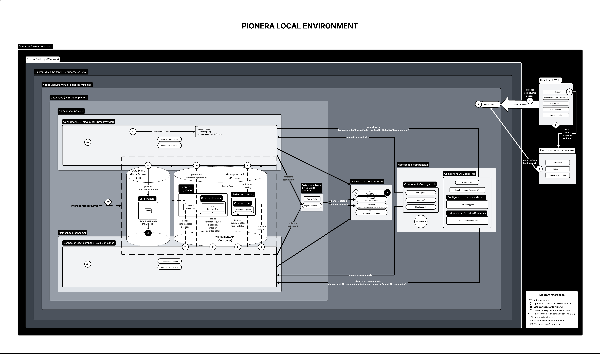

# Validation-Environment

Validation-Environment is a framework for building reproducible validation
environments for PIONERA dataspaces. It deploys dataspaces, validates
connectors, runs functional tests, collects metrics, and produces traceable
experimental evidence.



_Reference of the framework's `local` topology._

The main entry point is `main.py`. The framework is organized to work with
different adapters and topologies without duplicating common validation
logic.

## Recommended Operating Environment

The recommended way to run the framework from a workstation is Windows with
WSL: WSL runs the CLI, Docker Desktop provides the container engine for the
`local` topology, and the framework manages the SSH access, kubeconfigs, and
tunnels needed to operate VM topologies from the same terminal.

The framework also supports running directly inside a VM, but WSL on Windows
remains the primary documented path for operation and debugging.

## Project Status

The repository consolidates the framework as a deployment, validation, and
evidence-generation tool. It includes:

- level-based execution (`1-6`)
- `inesdata` and `edc` adapters
- `local`, `vm-single`, and `vm-distributed` topologies
- validation via Newman, Playwright, optional Kafka, and components
- evidence generation under `experiments/`
- public documentation in `docs/`

Detailed status: [docs/30_framework_current_state.md](./docs/30_framework_current_state.md).

### Closure Scope

| Adapter | `local` | `vm-single` | `vm-distributed` |
| --- | --- | --- | --- |
| `inesdata` | Implemented, used as the local dev/validation path | Implemented and validated as the reference VM environment | Implemented and validated as the reference distributed environment |
| `edc` | Implemented; passed validation before the recent topology reconciliation and should be revalidated before use as current evidence | Implemented; not officially validated after the recent reconciliation | Implemented and officially tested as the closure path for EDC |

For `edc` closure evidence, use `vm-distributed`. The `local` and `vm-single`
EDC paths remain available for development and future revalidation, but are
not presented as up-to-date official results in this closure version.

## Main Features

- deploy a dataspace level by level
- select the connector adapter: `inesdata` or `edc`
- provision common services (Keycloak, MinIO, PostgreSQL, Vault)
- deploy provider/consumer connectors
- deploy optional components (`ontology-hub`, `ai-model-hub`) when supported
  by the adapter
- plan/apply `hosts` entries idempotently
- run API validation with Newman and UI validation with Playwright
- check MinIO transfers and storage
- collect control-plane metrics and optional Kafka benchmarks
- persist results under `experiments/`

## Adapters

| Adapter | Use |
| --- | --- |
| `inesdata` | Deployment and validation with INESData connectors and its portal. |
| `edc` | Deployment and validation with generic EDC connectors; official closure evidence is limited to `vm-distributed`. |

Each adapter has its own deployer: `deployers/inesdata/`, `deployers/edc/`.
Shared artifacts live in `deployers/shared/` and `deployers/infrastructure/`.

## Topologies

`local`, `vm-single`, `vm-distributed`.

- `local`: development/validation on the operator machine.
- `vm-single`: single VM with a framework-managed Kubernetes cluster.
- `vm-distributed`: common services, connectors, and components split by
  infrastructure role, configured via local profiles and SSH/HTTP/Kubernetes
  preflight checks.

All three share the same level, adapter, and namespace model. Real domain,
IP, SSH, kubeconfig, and credential values stay in local, git-ignored files
or environment variables — never in versioned documentation.

An implemented topology does not imply official closure evidence for every
adapter; check the closure table above before running an audit.

## Installation

```bash
git clone https://github.com/ProyectoPIONERA/Validation-Environment.git
cd Validation-Environment
git submodule update --init --recursive
bash scripts/bootstrap_framework.sh
source .venv/bin/activate
python3 main.py menu
```

`bootstrap_framework.sh` installs Python/Node/Playwright dependencies and, on
Linux/WSL, the system packages Playwright needs. Node.js/npm are required for
Newman and Playwright; Java 17+ is required to build local EDC/INESData
connector images. Use `--without-system-deps` if your environment can't
install system packages.

The bootstrap also creates `deployer.config` and topology overlay files from
their `.example` templates the first time, without overwriting existing
ones.

Full walkthrough, including the `vm-single`-on-a-VM quickstart:
[docs/32_getting_started.md](./docs/32_getting_started.md).

## Configuration

- Common infrastructure: `deployers/infrastructure/deployer.config`
- Per-adapter: `deployers/inesdata/deployer.config`, `deployers/edc/deployer.config`
- Use the `.example` files as templates.

`PUBLIC_HOSTNAME` in `deployers/infrastructure/deployer.config` sets the
environment's public hostname; `bootstrap.py` uses it to configure
Keycloak's `frontendUrl` so JWT tokens carry the correct issuer for external
HTTPS access.

Values can also be overridden with `PIONERA_*` environment variables, e.g.:

```bash
PIONERA_DS_1_NAME=demo PIONERA_DS_1_NAMESPACE=demo python3 main.py inesdata hosts --topology local --dry-run
```

Local `hosts` file management, adapter coexistence rules, and VM-specific
configuration: [docs/32_getting_started.md](./docs/32_getting_started.md) and
[docs/35_deployers_and_topologies.md](./docs/35_deployers_and_topologies.md).

## Usage

Open the guided menu:

```bash
python3 main.py menu
```

| Level | Action |
| --- | --- |
| `1` | Setup Cluster |
| `2` | Deploy Common Services |
| `3` | Deploy Dataspace |
| `4` | Deploy Connectors |
| `5` | Deploy Components |
| `6` | Run Validation Tests |

Option `0` runs levels `1`-`6` sequentially.

| Option | Use |
| --- | --- |
| `S` | Preselect the adapter for the current menu session |
| `P` | Preview the deployment plan |
| `H` | Plan/apply `hosts` entries |
| `U` | Show access URLs for the active configuration |
| `M` | Run standalone metrics/benchmarks |
| `X` | Recreate the selected dataspace |
| `B/D/R/C/L` | Dev shortcuts: bootstrap, doctor, recovery, cleanup, local images |
| `I/O/A` | UI validation for INESData, Ontology Hub, AI Model Hub |
| `?` / `Q` | Help / quit |

CLI equivalents:

```bash
python3 main.py list
python3 main.py inesdata deploy --topology local
python3 main.py edc run --topology vm-distributed --dry-run
python3 main.py edc recreate-dataspace --topology local --confirm-dataspace demoedc
```

Full menu reference: [docs/33_menu_reference.md](./docs/33_menu_reference.md).

## Requirements

| Group | Main tools |
| --- | --- |
| Local base | Python 3.10+, Git, Docker |
| Local Kubernetes | Minikube, Helm, `kubectl` |
| Validation | Node.js, npm, Newman, Playwright |
| Connector builds | Java 17+ / OpenJDK 17 |
| Operations | `psql`, permissions to edit `hosts` when applicable |

`bash scripts/bootstrap_framework.sh` prepares `.venv`, Python/Node
dependencies, and Playwright browsers.

## Validation

`Level 6` runs the active adapter's full validation: Newman, EDC+Kafka
functional validation (when supported), Playwright, MinIO/storage checks,
component validation, metrics, and reports under `experiments/`.

Official closure evidence for `edc` is currently limited to
`vm-distributed` (see the closure table above).

Details, Newman collections, and Kafka benchmarking:
[docs/37_validation.md](./docs/37_validation.md).

## Repository Structure

| Path | Description |
| --- | --- |
| `main.py` | Main CLI and guided menu |
| `framework/` | Reusable validation, metrics, and reporting core |
| `adapters/` | Adapter-specific integrations |
| `deployers/` | Deployers, configuration, and deployment artifacts |
| `deployers/infrastructure/` | Contracts, topologies, hosts, cross-cutting utilities |
| `deployers/shared/` | Reusable charts and artifacts |
| `validation/` | Newman, Playwright, and component validation suites |
| `tests/` | Framework unit tests |
| `docs/` | Stable framework documentation |

## Tests

```bash
python3 -m unittest discover tests
```

## Documentation

Full documentation: [docs/](./docs/README.md).

Recommended reading order:

- [Getting started](./docs/32_getting_started.md)
- [Menu reference](./docs/33_menu_reference.md)
- [Architecture](./docs/34_architecture.md)
- [Deployers and topologies](./docs/35_deployers_and_topologies.md)
- [Adapters](./docs/36_adapters.md)
- [Validation](./docs/37_validation.md)
- [Development and testing](./docs/38_development_and_testing.md)
- [Troubleshooting](./docs/39_troubleshooting.md)
- [Connector external access](./docs/41_pionera_connector_external_access.md)
- [Audit navigation guide](./docs/44_audit_navigation_guide.md)
- [vm-distributed runbook](./docs/46_vm_distributed_runbook.md)

## Contributing

1. Open an issue describing the change, bug, or improvement.
2. Create a fork or working branch.
3. Run the relevant tests before opening a pull request.
4. Open a pull request explaining the goal, scope, tests run, and known
   risks.

Never include credentials, tokens, private keys, real kubeconfigs, secrets
in logs, or personal data in commits, issues, or pull requests.

## Technical References

- [INESData local environment](https://github.com/INESData/inesdata-local-env)
- [INESData connector management API collection](https://github.com/INESData/inesdata-local-env/blob/master/resources/operations/InesData_Connector_Management_API.postman_collection.json)
- [Eclipse EDC Management API](https://eclipse-edc.github.io/Connector/openapi/management-api/#/)
- [Eclipse EDC Kafka sample](https://github.com/eclipse-edc/Samples/tree/main/transfer/transfer-06-kafka-broker)
- [DataSpaceUnit local deployment](https://github.com/DataSpaceUnit/ds-local-deployment)

## Acknowledgments and Funding

This work has received funding from the **PIONERA project** (Enhancing
interoperability in data spaces through artificial intelligence), funded
under the call for Technological Products and Services for Data Spaces of
the Spanish Ministry for Digital Transformation and the Civil Service,
within the PRTR framework funded by the European Union (NextGenerationEU).

<div align="center">
  
</div>

---

## Authors and Contact

This repository is part of the PIONERA project's software work. For
questions, issues, or change proposals, use the GitHub issues and pull
requests of this repository.

- **Framework maintainers:**
  - Adrián Vargas (<adrian.vargas@upm.es>)
  - Raffaele Cuzzaniti (<r.cuzzaniti@upm.es>)

## License

Validation-Environment is available under the **[Apache License 2.0](./LICENSE)**.
